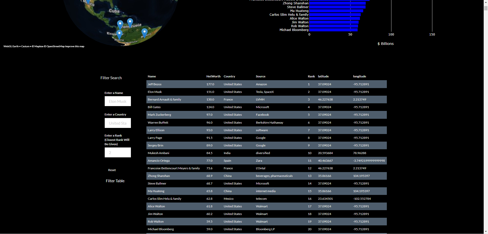

# billionaire-project

## Project Description

For this project our team created a web application using a flask server. The web application displays a dashboard of 2021 Forbes Billionaire data.

To complete this project we created a flask server that retreives data from a postgres database and returns json data. The web application uses javascript to read the json data from the flask server using an api request.

The dashboard allows for user interaction to explore the dataset and visualize the data. We utilized leaflet, plotly and d3 to create and manipulate the visualizations.

#
 View the [website here](https://jonweber0328.github.io/billionaire-project/) or follow the instructions below. The hyperlink website was set up in a different [repository](https://github.com/JonWeber0328/billionaire-project) using the same data from a .csv file.
#

## Setup Instructions

### Follow these instructions to set up a database and deploy the app

1. Go to [https://github.com/mpetersen49/billionaire-project](https://github.com/mpetersen49/billionaire-project) and clone the repo to your machine
1. Open `pgAdmin` and create a new database titled `billionaires_db`
1. Open a new query tool on `billionaires_db`
1. Navigate to and Open `schema.sql` from the `static/data` folder in the project repo
1. Run the query to set up the billionaires table
1. Create a `config.py` file in the root directory of the project repo
1. Within `config.py` enter your postgres username and password as variables called `username` and `password`
1. Open a new git bash terminal on the billionaire-project repo
1. Type `source activate PythonData` and press enter
1. Type `jupyter notebook` and press enter
1. Open `ETL.ipynb` and run all cells to transfer data to the database
1. Open a new git bash terminal on the billionaire-project repo
1. Make sure you are in the root directory where `app.py` is located
1. Type `source activate PythonData` and press enter
1. Type `python app.py` and press enter to run the flask server
1. Open a chrome browser and navigate to `http://127.0.0.1:5000/`
#
### To close the application:

1. Close the chrome browser
1. In the git bash terminal hit `CTRL+C` to stop the flask server
1. Close the git bash terminal
#
### Website Preview

#

#

#

